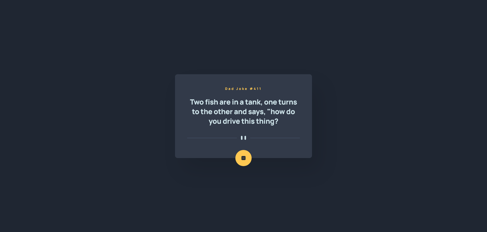
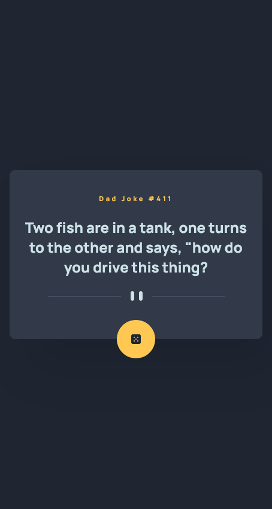

# Dad Joke Generator App

## Table of contents

- [Overview](#overview)
  - [The challenge](#the-challenge)
  - [Screenshot](#screenshot)
  - [Links](#links)
- [My process](#my-process)
  - [Built with](#built-with)
  - [What I learned](#what-i-learned)
  - [Continued development](#continued-development)
  - [Useful resources](#useful-resources)
- [Author](#author)

## Overview

### The challenge

Users should be able to:

- View the optimal layout for the app depending on their device's screen size.
- See hover states for all interactive elements on the page.
- Generate a new piece of advice by clicking the dice icon.

### Screenshot

### Links

- Solution URL: [GitHub](https://github.com/wesleyjacoby/Dad-Joke-Generator-App)
- Live Site URL: [GitHub Pages](https://wesleyjacoby.github.io/Dad-Joke-Generator-App/)

## My process

### Built with

- Semantic HTML5 Markup
- CSS Custom Properties
- Flexbox
- Mobile-first Workflow

### What I learned

This was my second time using an API and I found it relatively easy after watching a lot of videos. I opted to use [Axios](https://github.com/axios/axios), which makes things a lot easier. This did use a header as well for the API call.

### Continued development

I will continue to do more projects that use an API for added practice and learning.

### Useful resources

- [Axios Documentation](https://github.com/axios/axios) - This is the Axios documentation.

## Author

- Frontend Mentor - [@wesleyjacoby](https://www.frontendmentor.io/profile/wesleyjacoby)